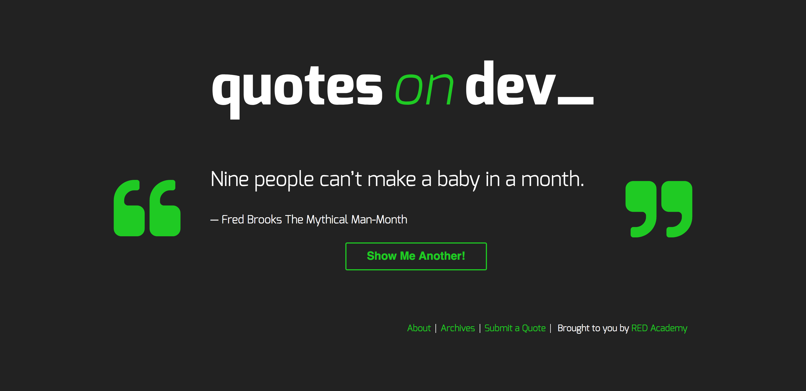
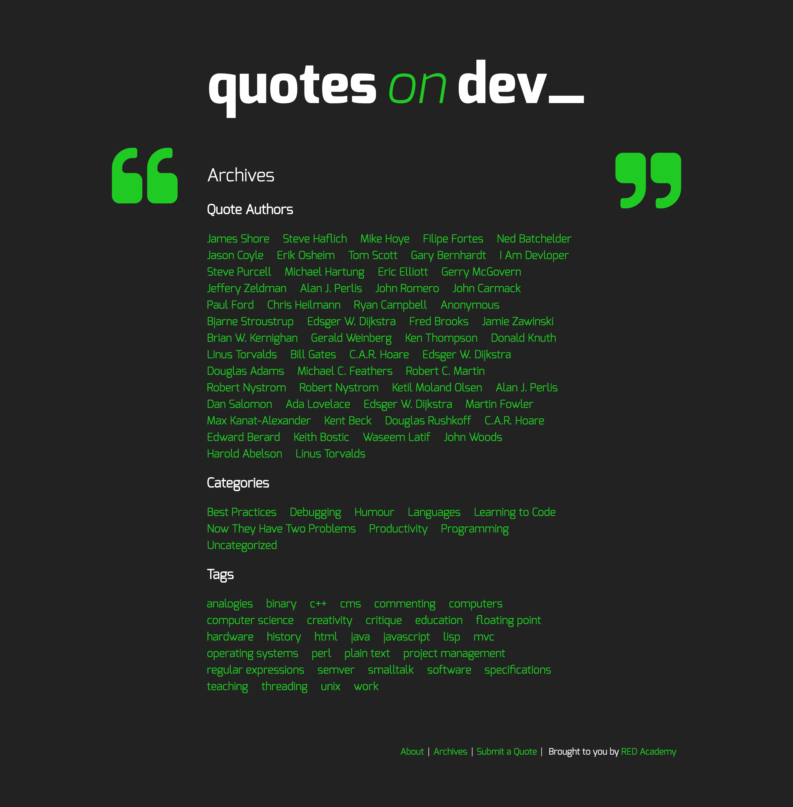
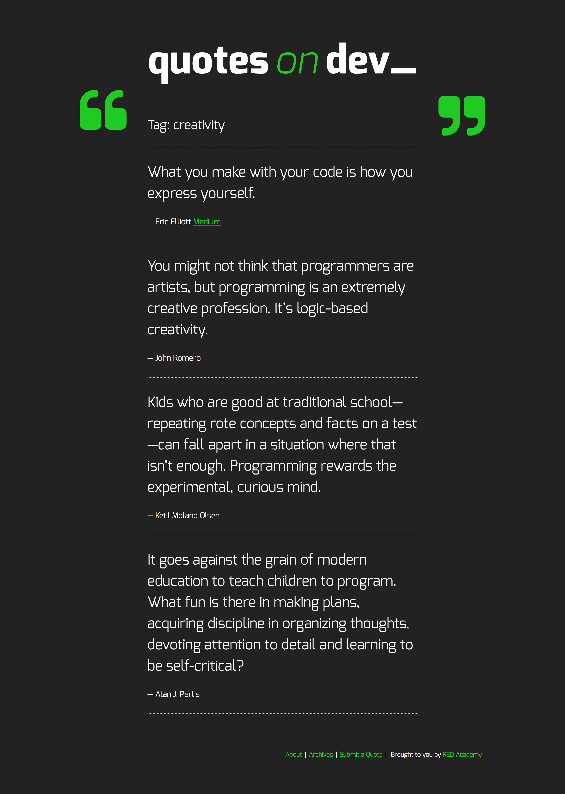
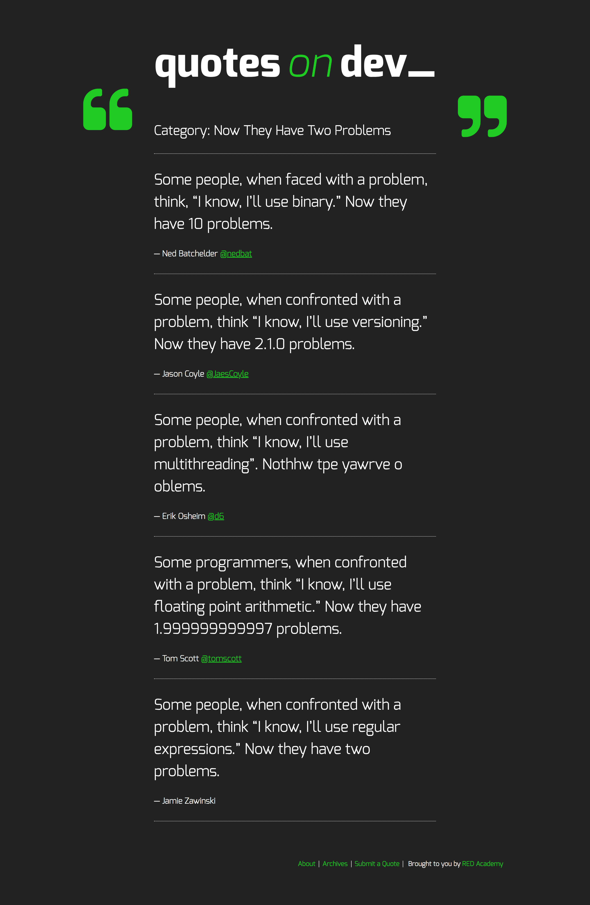
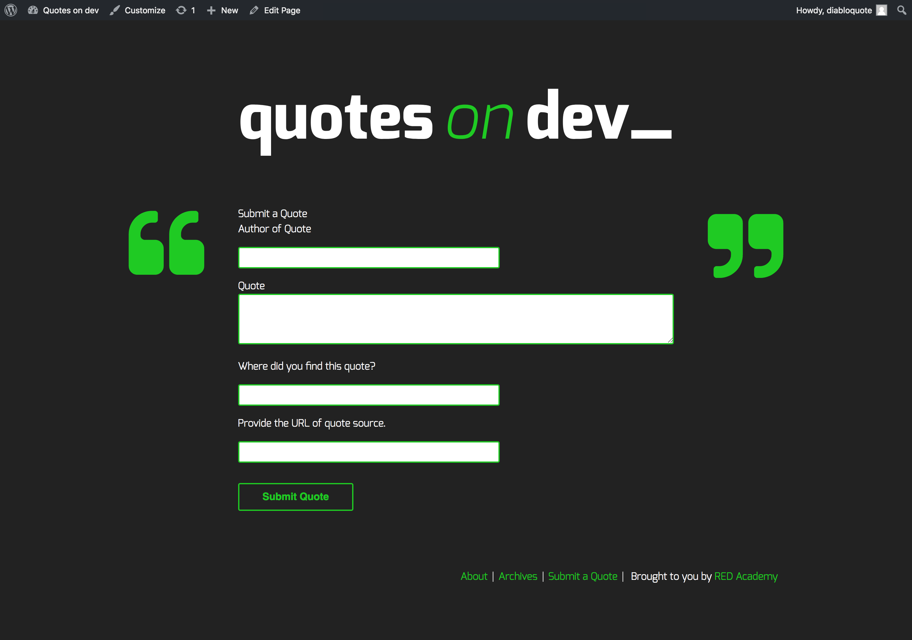
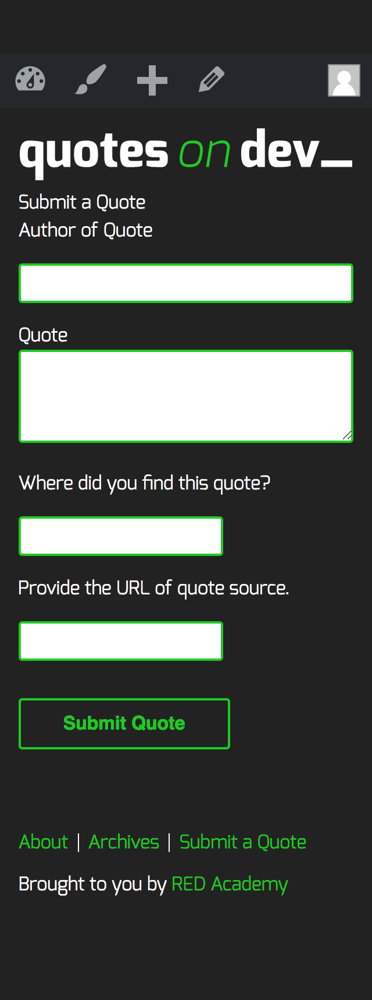

# Quotes on Dev 

A wordpress theme replicated after 'Quotes on Dev' - a site inspired by Chris Coyier's "Quotes on Design".
Quotes on Dev uses a custom Rest Api to randomly fetch and return posts when the 'Show me another' button
is clicked. The front page uses a GET request to a WP API to dynamically add a new quote without having 
to refresh each time, it also uses a POST request to submit a new quote into the site's database.

## screenshot

* Displayed on the Home page is a quote and button that on click would generate another random quote. Pressing this button triggers an ajax request to the rest api, displaying a new random quote from the stored quotes contained in the blog posts.

## Tech used

* Wordpress
* Javascript
* Jquery
* Databases
* PHP
* Gulp
* SASS/HTML

## Set up

* Install dependencies: > npm i

## Functionality

* Be built using WordPress as CMS
* Contain a About page, an Archives page, and Submit a Quote page
* Contain a blog post index page and a single view for blog posts
* Contain a search results page and 404 page
* Fetch an initial random post on the front page
* Fetch additional random posts on the front page using the WP API
* Display one item per page for the blog index and author archives, 
  five items per page for category and tag archives, and ten items per page for search results
* Accept new quote submissions from the front-end of the site using WP API (for logged in users only), 
  and set those submissions to * *   pending by default
* Show a message to unauthenticated users on the “Submit a Quote” page that informs them they must log in to submit a new quote

## WordPress goals

* Use the quotesondev-starter WordPress theme as a base for building your project
* Support default Posts and Page (no Comments)
* Use a WordPress menu (configured through the admin interface) for the main site navigation
* Include a custom page template for the “Archives” page that displays post, category, and tag archives
* Include a custom page template for the “Submit a Quote” page
* Properly enqueue CSS and JS files in the theme’s functions.php file
* Leverage the WP template hierarchy to generate required layouts for the website
* Be validated with Theme Check

